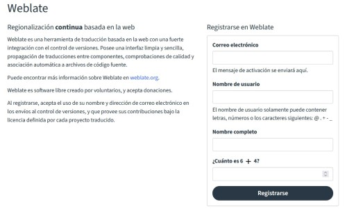
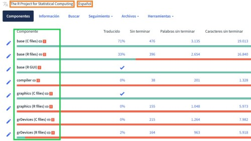
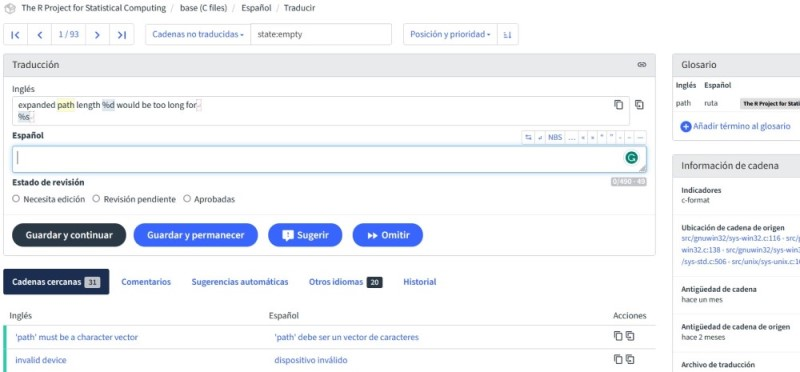

# Quiénes somos

.pull-left[

### María Nanton
Universidad de Buenos Aires
R-Ladies BA
]

.pull-right[

### Pao Corrales
Universidad de Buenos Aires
R-Ladies Global Team
]

---
# El proyecto: traducción colaborativa de R base (y paquetes recomendados)

Forma parte del R Contribution Working Group que busca fomentar una comunidad más amplia y diversa de personas que contribuyan al desarrollo de R.

* + 20 idiomas
* ~ 150k strings por idioma
* decenas de personas colaborando en todo el mundo!

---
class: chapter-slide

# Entonces... ¿cómo arrancar?

---
# Paso 1:
Crea tu usuario en Weblate en https://translate.rx.studio/

.center[]

---
# Paso 2:
Elige el proyecto, idioma al que quieres contribuir y un componente en el que trabajar

.center[]

---
# Paso 3:
A traducir!
.center[]

---
# Recursos que debes conocer

* Sitio con pautas de traducción:
https://contributor.r-project.org/translations/
    * [Pautas para traducir al Español](https://contributor.r-project.org/translations/Conventions_for_Languages/Spanish-specific-translations.html)
    * [Pautas para traducir al Portugues](https://contributor.r-project.org/translations/Conventions_for_Languages/Brazilian%E2%80%90Portugese-specific-translations.html)
* Glosario para tu idioma (puedes acceder desde Weblate)
* [Guía de desarrollo de R, capítulo 9.2](https://contributor.r-project.org/rdevguide/)

--

**¡Sumate a la discusion!**

[R Contributors Slack](https://contributor.r-project.org/slack)
* `#core-translation`
* `#core-translation-es`

---
# ¡Necesitamos tu ayuda!

| Idioma | The R Project for Statistical Computing | The R Project recommended packages |
|:------|:-----:|:------:|
|Español | 40% | 0%|
|Portugues | 75% | Por inciar |

--

### La meta

Alcanzar el 100% de las traducciones para que se incorporen en la próxima versión de R que se publicará en abril de 2024.

---
class: chapter-slide

# Gracias!
